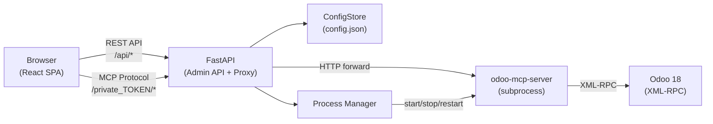
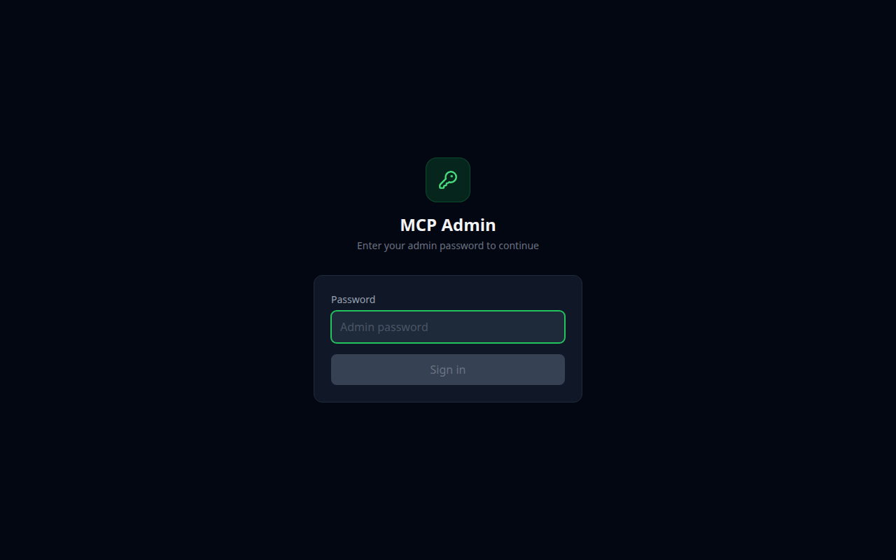
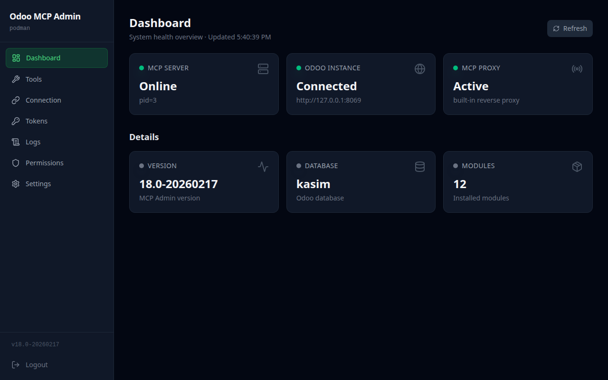
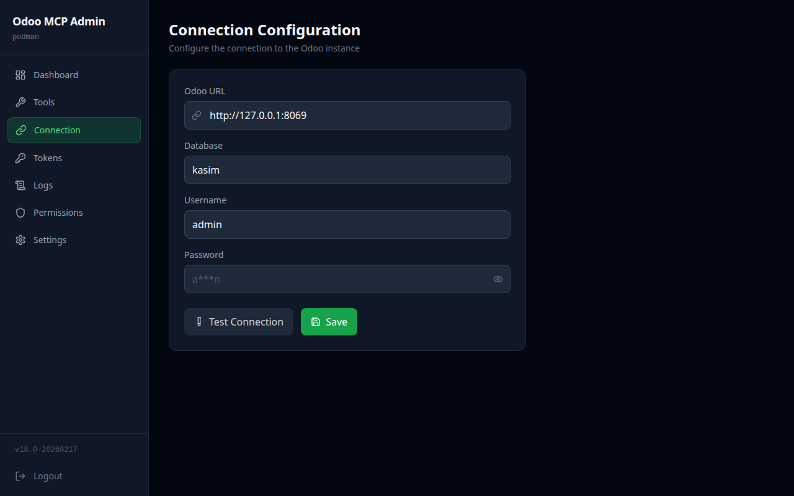
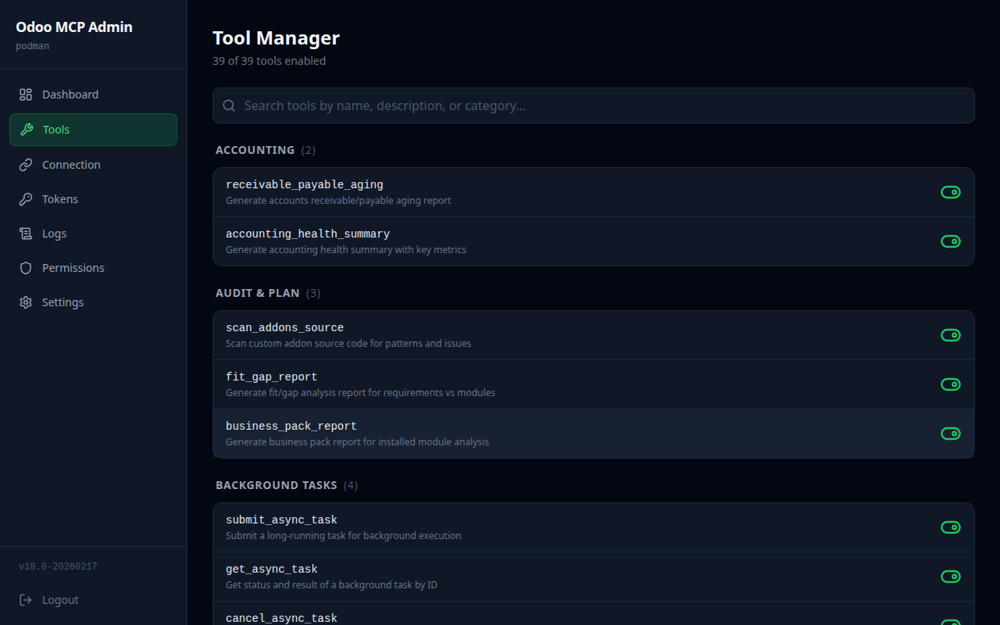
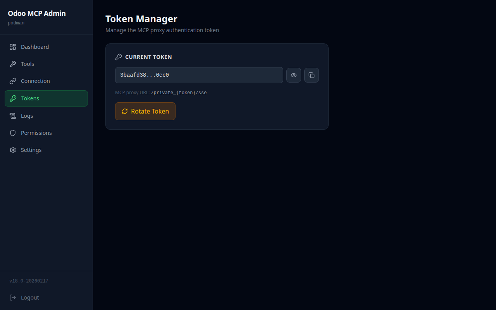
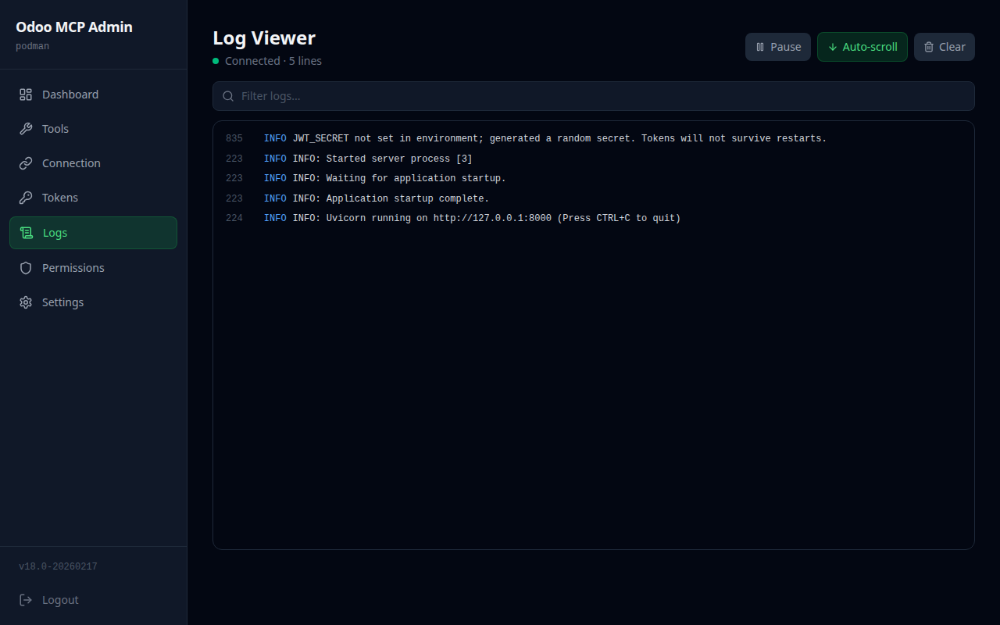
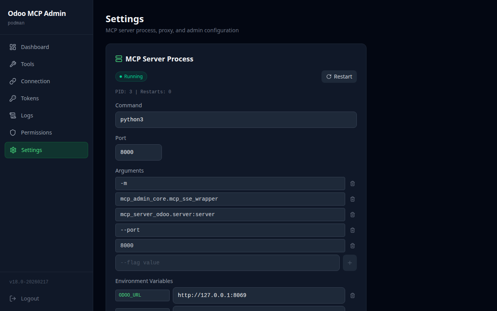

<p align="center">
  
</p>

<h1 align="center">Woow Odoo MCP Server</h1>

<p align="center">
  <strong>Production-Ready Admin Bundle for Odoo MCP Server</strong><br/>
  Web GUI + MCP Reverse Proxy + Process Manager — all in one container
</p>

<p align="center">
  <a href="#overview">Overview</a> &bull;
  <a href="#features">Features</a> &bull;
  <a href="#architecture">Architecture</a> &bull;
  <a href="#quick-start">Quick Start</a> &bull;
  <a href="#installation">Installation</a> &bull;
  <a href="#configuration">Configuration</a> &bull;
  <a href="#screenshots">Screenshots</a> &bull;
  <a href="#api-reference">API</a> &bull;
  <a href="#security">Security</a> &bull;
  <a href="#testing">Testing</a> &bull;
  <a href="#changelog">Changelog</a> &bull;
  <a href="README_zh-TW.md">中文文件</a>
</p>

<p align="center">
  
  
  
  
  
  
  
  
  
</p>

---

## Overview

**Woow Odoo MCP Server** is a complete administration bundle for managing [Odoo MCP Server](https://pypi.org/project/odoo-mcp-server/) deployments. It provides a modern web interface to configure Odoo connections, manage MCP tools, rotate authentication tokens, stream real-time logs, and proxy MCP protocol requests — all packaged into a single container image.

The bundle eliminates the need for separate nginx proxies, manual config file editing, or kubectl commands. Everything is managed through a clean, responsive web UI.

### Why This Package?

| Challenge | Solution |
|-----------|----------|
| MCP server config requires editing JSON files or K8s secrets by hand | Web-based GUI with live validation and one-click save |
| Token rotation involves manual secret updates + pod restarts | One-click token rotation with automatic MCP server restart |
| MCP proxy requires a separate nginx + auth config | Built-in reverse proxy with URL-path token authentication |
| Monitoring MCP server logs requires `kubectl logs` or SSH | Real-time SSE log streaming in the browser with search |
| Enabling/disabling MCP tools needs config edits + restarts | Visual tool manager with 10 categories and toggle switches |
| Testing Odoo connectivity needs XML-RPC scripting | One-click connection test with Odoo 18 auth format support |
| Deploying all components separately is complex | Single container with everything included |

---

## Features

### Dashboard

Real-time health monitoring for all components in the stack:

- **Odoo Status** — Checks `/web/health` endpoint; shows version, database name, and installed module count
- **MCP Server Status** — Subprocess health, PID, restart count
- **MCP Proxy Status** — Built-in proxy always healthy when admin is running
- **Overall Status** — Aggregated `ok` / `degraded` / `error` indicator

### Connection Configuration

Manage Odoo XML-RPC connection credentials:

- Configure Odoo URL, database name, username, and password
- **One-click connection test** with full error reporting
- Supports both **Odoo 18** (new `authenticate()` signature) and **Odoo 17** (legacy format)
- Auto-restart MCP server when connection config changes

### Tool Manager

Visual management of all **39 MCP tools** organized into **10 categories**:

| Category | Count | Description |
|----------|-------|-------------|
| Read & Discover | 11 | Schema browsing, record search, employee/holiday lookup |
| Write & Operate | 5 | Preview, validate, execute writes, chatter posts |
| Diagnose | 3 | Error analysis, access rights debugging, relationship inspection |
| Migrate | 3 | JSON2 payloads, upgrade risk reports, version history |
| Audit & Plan | 3 | Addon source scanning, fit/gap analysis, business pack reports |
| Knowledge | 3 | Knowledge base indexing, semantic search, coverage stats |
| Accounting | 2 | AR/AP aging, accounting health summaries |
| Background Tasks | 4 | Async task submission, status, cancellation, listing |
| Cross-Instance | 3 | Multi-instance search, aggregation, health comparison |
| Utility | 2 | Health check, instance listing |

Each tool can be individually enabled or disabled. Dangerous (write) tools are clearly marked with a warning indicator.

### Token Manager

Manage MCP proxy authentication tokens:

- View current token (masked) with prefix identification
- **One-click token rotation** with cryptographically secure generation
- Configurable token length (16-128 bytes, output is 2x hex)
- Rotation history with timestamps (last 10 rotations)
- Optional automatic MCP server restart after rotation

### Log Viewer

Real-time MCP server log streaming:

- **Server-Sent Events (SSE)** for zero-latency log delivery
- In-memory ring buffer (5000 lines) with configurable tail
- **Full-text search** with plain text and regex support
- Timestamped log entries with source identification
- Auto-scroll with pause on user interaction

### Settings

Full configuration management:

- View and edit the complete `config.json` through the GUI
- Per-section editing: connection, mcp_server, proxy, tools
- Admin password management
- MCP auth token rotation
- **MCP server restart** and status monitoring

### MCP Reverse Proxy

Built-in reverse proxy replacing the traditional nginx auth proxy:

- **URL-path token authentication**: `/private_{token}/sse`, `/private_{token}/messages`
- Compatible with Claude Desktop, Cursor, and all MCP clients
- Full SSE streaming support for MCP protocol
- Long timeout (86400s default) for long-running tool calls
- Bearer token forwarding for upstream auth

---

## Architecture



The application follows a clean layered architecture:

```
┌─────────────────────────────────────────────────────┐
│                   Browser (React SPA)                │
│  Login → Dashboard → Connection → Tools → Tokens     │
│                  → Logs → Settings                    │
├─────────────────────────────────────────────────────┤
│                FastAPI Application                    │
│  ┌──────────┐ ┌──────────┐ ┌──────────┐             │
│  │ Auth     │ │ Admin    │ │ MCP      │             │
│  │ Middle-  │ │ Routers  │ │ Proxy    │             │
│  │ ware     │ │ (7 sets) │ │ Router   │             │
│  └────┬─────┘ └────┬─────┘ └────┬─────┘             │
│       │            │            │                    │
│  ┌────▼────────────▼────────────▼─────┐              │
│  │         Core Services              │              │
│  │  ConfigStore │ ProcessManager      │              │
│  └────────────────────────────────────┘              │
├─────────────────────────────────────────────────────┤
│  odoo-mcp-server (subprocess on :8000)               │
│  39 MCP tools │ SSE transport │ XML-RPC client       │
├─────────────────────────────────────────────────────┤
│  Odoo 18 (external, :8069)                           │
│  PostgreSQL │ Business Logic │ ORM                   │
└─────────────────────────────────────────────────────┘
```

**Key packages:**

| Package | Description |
|---------|-------------|
| `mcp_admin_core` | Shared foundation: FastAPI app factory, JWT auth middleware, file-based config store, subprocess process manager, MCP reverse proxy |
| `odoo_mcp_admin` | Odoo-specific routers: connection config, health dashboard, 39-tool registry, token manager, SSE log viewer |
| `frontend` | React 19 SPA with Tailwind CSS, built with Vite |

For detailed architecture documentation with Mermaid diagrams, see [docs/architecture.md](docs/architecture.md).

---

## Quick Start

### One-Liner (Podman or Docker)

```bash
# Podman
podman run -d --name mcp-admin \
  -p 8080:8080 \
  -v mcp-data:/data \
  ghcr.io/woowtech/woow-odoo-mcp-server:latest

# Docker
docker run -d --name mcp-admin \
  -p 8080:8080 \
  -v mcp-data:/data \
  ghcr.io/woowtech/woow-odoo-mcp-server:latest
```

Open `http://localhost:8080` and log in with the default password: `admin`.

### Docker Compose (Full Stack)

Spin up Odoo 18 + PostgreSQL + MCP Admin in one command:

```bash
git clone https://github.com/WOOWTECH/woow_odoo_mcp_server.git
cd woow_odoo_mcp_server
docker compose up -d
```

This starts three services:

| Service | Port | Description |
|---------|------|-------------|
| `postgres` | 5432 (internal) | PostgreSQL 16 with health checks |
| `odoo` | 8069 | Odoo 18 Community |
| `mcp-admin` | 8080 | MCP Admin Bundle |

After Odoo finishes initializing, open `http://localhost:8080` and configure the connection:

- **Odoo URL**: `http://odoo:8069`
- **Database**: `odoo`
- **Username**: `admin`
- **Password**: `admin`

---

## Installation

### Option 1: Podman (Recommended)

Podman is rootless and daemonless, making it ideal for MCP server deployments.

```bash
# Build from source
podman build -t woow-odoo-mcp-server .

# Run with persistent config
podman run -d --name mcp-admin \
  -p 8080:8080 \
  -v mcp-data:/data \
  woow-odoo-mcp-server

# View logs
podman logs -f mcp-admin
```

### Option 2: Docker

```bash
# Build
docker build -t woow-odoo-mcp-server .

# Run
docker run -d --name mcp-admin \
  -p 8080:8080 \
  -v mcp-data:/data \
  -e JWT_SECRET=your-secret-here \
  woow-odoo-mcp-server
```

### Option 3: Docker Compose

```bash
# Full stack (PostgreSQL + Odoo + MCP Admin)
docker compose up -d

# MCP Admin only (connect to existing Odoo)
docker compose up -d mcp-admin
```

### Option 4: Kubernetes (K3s)

Deploy to a Kubernetes cluster with RBAC, health checks, and resource limits:

```bash
# Apply the manifests (adjust namespace as needed)
kubectl apply -f k8s-deploy.yaml

# Check deployment status
kubectl get pods -n kasim-odoo -l app=odoo-mcp-admin

# Port-forward for local access
kubectl port-forward -n kasim-odoo svc/odoo-mcp-admin-svc 8080:9001
```

The K8s deployment includes:

- **ServiceAccount** with namespace-scoped RBAC (Secrets, ConfigMaps, Pods, Deployments)
- **Readiness probe** on `/healthz` (5s initial delay, 10s interval)
- **Liveness probe** on `/healthz` (15s initial delay, 30s interval)
- **Resource limits**: 100m-500m CPU, 128Mi-512Mi memory
- **Control-plane nodeSelector** for predictable scheduling

### Option 5: Development Mode

```bash
# Backend
python -m venv .venv
source .venv/bin/activate
pip install -e ".[dev]"
uvicorn odoo_mcp_admin.main:app --host 0.0.0.0 --port 8080 --reload

# Frontend (separate terminal)
cd frontend
npm install
npm run dev
```

---

## Configuration

### Web GUI Walkthrough

After starting the container:

1. **Login** — Navigate to `http://localhost:8080` and enter the admin password (default: `admin`)
2. **Connection** — Go to the Connection page, enter your Odoo URL, database, username, and password, then click **Test Connection**
3. **Tools** — Browse all 39 MCP tools, toggle individual tools on/off as needed
4. **Tokens** — Generate an MCP auth token by clicking **Rotate Token** -- save it for your MCP client configuration
5. **Settings** — Configure MCP server command, port, and environment variables
6. **Dashboard** — Verify all components show green healthy status

### config.json Format

The configuration file is automatically created on first run at `/data/config.json`:

```json
{
  "admin_password": "admin",
  "mcp_auth_token": "a1b2c3d4e5f6...",
  "connection": {
    "odoo_url": "http://odoo:8069",
    "odoo_db": "mydb",
    "odoo_username": "admin",
    "odoo_password": "secret"
  },
  "mcp_server": {
    "command": "odoo-mcp-server",
    "args": ["--transport", "sse"],
    "port": 8000,
    "env": {
      "ODOO_URL": "http://odoo:8069",
      "ODOO_DB": "mydb"
    }
  },
  "proxy": {
    "timeout": 86400,
    "bearer_token": null
  },
  "tools": {
    "disabled": ["execute_method"],
    "disabled_operations": {}
  },
  "token_history": []
}
```

### Environment Variables

| Variable | Default | Description |
|----------|---------|-------------|
| `MCP_ADMIN_CONFIG` | `/data/config.json` | Path to the configuration file |
| `JWT_SECRET` | (auto-generated) | Secret key for JWT token signing. Set this for token persistence across restarts |
| `JWT_EXPIRY_HOURS` | `24` | JWT token expiry time in hours |

### MCP Client Configuration

After generating a token through the admin UI, configure your MCP client:

**Claude Desktop / Cursor:**

```json
{
  "mcpServers": {
    "odoo": {
      "url": "http://your-server:8080/private_YOUR_TOKEN_HERE/sse"
    }
  }
}
```

**Claude Code CLI:**

```bash
claude mcp add odoo --transport sse \
  http://your-server:8080/private_YOUR_TOKEN_HERE/sse
```

---

## Screenshots

### Login

<p align="center">
  
</p>

JWT-based authentication. Default password is `admin`. Supports cookie-based and Authorization header auth.

### Dashboard

<p align="center">
  
</p>

Real-time health monitoring for Odoo, MCP Server, and MCP Proxy. Shows Odoo version, database name, installed module count, and overall system status.

### Connection Configuration

<p align="center">
  
</p>

Configure and test Odoo XML-RPC connectivity. Supports both Odoo 18 (new credential dict format) and Odoo 17 (positional arguments). One-click test with detailed error reporting.

### Tool Manager

<p align="center">
  
</p>

Visual management of all 39 MCP tools across 10 categories. Toggle individual tools on/off. Dangerous (write) tools are clearly marked. Changes are persisted immediately.

### Token Manager

<p align="center">
  
</p>

Manage MCP proxy authentication tokens. One-click rotation with cryptographic token generation. Rotation history with timestamps. Token is displayed once after rotation.

### Log Viewer

<p align="center">
  
</p>

Real-time SSE log streaming from the MCP server subprocess. In-memory ring buffer with full-text and regex search. Auto-scroll with manual pause support.

### Settings

<p align="center">
  
</p>

Full configuration management. Edit MCP server command, arguments, port, environment variables. Admin password management. MCP server restart with status monitoring.

---

## API Reference

All API endpoints require JWT authentication (except login and health check).

### Authentication

| Method | Endpoint | Description |
|--------|----------|-------------|
| `POST` | `/api/auth/login` | Authenticate with admin password, returns JWT |

### Health & Dashboard

| Method | Endpoint | Description |
|--------|----------|-------------|
| `GET` | `/healthz` | Basic health check (no auth required) |
| `GET` | `/api/health` | Full dashboard health data (Odoo, MCP, Proxy status) |

### Connection Configuration

| Method | Endpoint | Description |
|--------|----------|-------------|
| `GET` | `/api/config` | Get current Odoo connection config (password masked) |
| `PUT` | `/api/config/connection` | Update Odoo connection credentials |
| `POST` | `/api/config/test` | Test XML-RPC connectivity to Odoo |

### Tool Management

| Method | Endpoint | Description |
|--------|----------|-------------|
| `GET` | `/api/tools` | List all 39 tools with categories and enabled status |
| `PUT` | `/api/tools` | Update tool enable/disable states |

### Token Management

| Method | Endpoint | Description |
|--------|----------|-------------|
| `GET` | `/api/tokens` | Get current token (masked) and rotation history |
| `POST` | `/api/tokens/rotate` | Generate new token, update config, restart server |

### Settings

| Method | Endpoint | Description |
|--------|----------|-------------|
| `GET` | `/api/settings` | Get full config (passwords masked) |
| `PUT` | `/api/settings/{section}` | Update a config section |
| `GET` | `/api/settings/{section}` | Get a single config section |
| `POST` | `/api/settings/mcp_auth_token/rotate` | Rotate MCP auth token |
| `GET` | `/api/settings/mcp/status` | MCP server process status |
| `POST` | `/api/settings/mcp/restart` | Restart MCP server process |

### Log Streaming

| Method | Endpoint | Description |
|--------|----------|-------------|
| `GET` | `/api/logs/stream` | SSE endpoint for real-time log streaming |
| `GET` | `/api/logs/search` | Search in-memory log buffer (text or regex) |

### MCP Proxy

| Method | Endpoint | Description |
|--------|----------|-------------|
| `*` | `/private_{token}/{path}` | Reverse proxy to MCP server (all HTTP methods) |

---

## Security

### Authentication

- **JWT-based authentication** with configurable expiry (default: 24 hours)
- Admin password stored in `config.json` (change from default immediately)
- JWT secret auto-generated on startup if `JWT_SECRET` env var is not set
- Cookie-based auth with `httponly`, `samesite=strict` flags
- SSE endpoints support query parameter token for EventSource compatibility

### MCP Token Authentication

- MCP proxy validates URL-path tokens against the config store
- Tokens are cryptographically generated using `secrets.token_hex()`
- Token rotation invalidates the previous token immediately
- Token history maintains last 10 rotation records for audit
- Sensitive values are masked in all API responses

### Network Security

- CORS middleware configured (default: allow all origins -- restrict in production)
- Auth middleware enforces JWT on all `/api/*` routes except login
- MCP proxy paths (`/private_*`) bypass JWT auth (token validated by proxy itself)
- Kubernetes deployment includes RBAC with namespace-scoped permissions only

### Best Practices

1. **Change the default admin password** immediately after first login
2. **Set `JWT_SECRET`** environment variable for token persistence across restarts
3. **Restrict CORS origins** in production deployments
4. **Use Kubernetes NetworkPolicy** to limit pod-to-pod communication
5. **Disable dangerous tools** (Write & Operate category) unless explicitly needed
6. **Rotate MCP tokens** regularly using the Token Manager

---

## Testing

### Test Coverage Summary

The admin bundle has been validated with a comprehensive 22-point test matrix:

| # | Test Case | Status |
|---|-----------|--------|
| 1 | Container builds successfully | Pass |
| 2 | Container starts and listens on port 8080 | Pass |
| 3 | `/healthz` returns 200 | Pass |
| 4 | Login with correct password returns JWT | Pass |
| 5 | Login with wrong password returns 401 | Pass |
| 6 | API endpoints return 401 without token | Pass |
| 7 | Dashboard endpoint returns health data | Pass |
| 8 | Connection config GET returns masked password | Pass |
| 9 | Connection config PUT updates and persists | Pass |
| 10 | Connection test against live Odoo succeeds | Pass |
| 11 | Tool list returns 39 tools in 10 categories | Pass |
| 12 | Tool toggle persists disabled state | Pass |
| 13 | Token rotation generates new token | Pass |
| 14 | Token rotation restarts MCP server | Pass |
| 15 | Log stream SSE endpoint connects | Pass |
| 16 | Log search returns filtered results | Pass |
| 17 | Settings GET returns full config | Pass |
| 18 | Settings PUT updates individual sections | Pass |
| 19 | MCP proxy forwards to subprocess | Pass |
| 20 | MCP proxy rejects invalid token | Pass |
| 21 | Config persists across container restart | Pass |
| 22 | Frontend SPA loads and renders | Pass |

**Result: 22/22 tests passing**

### Running Tests

```bash
# Install dev dependencies
pip install -e ".[dev]"

# Run tests
pytest -v

# Run with coverage
pytest --cov=mcp_admin_core --cov=odoo_mcp_admin -v
```

---

## Project Structure

```
woow_odoo_mcp_server/
├── mcp_admin_core/              # Shared core library
│   ├── __init__.py
│   ├── app.py                   # FastAPI application factory
│   ├── process.py               # MCP subprocess manager
│   ├── proxy.py                 # MCP reverse proxy router
│   ├── mcp_sse_wrapper.py       # SSE transport wrapper
│   ├── auth/
│   │   ├── __init__.py
│   │   └── middleware.py        # JWT auth middleware + login router
│   ├── config/
│   │   ├── __init__.py
│   │   └── store.py             # File-based config store
│   ├── routers/
│   │   ├── __init__.py
│   │   └── settings.py          # Settings CRUD router
│   └── k8s/
│       ├── __init__.py
│       └── client.py            # Kubernetes API client
├── odoo_mcp_admin/              # Odoo-specific admin backend
│   ├── __init__.py
│   ├── main.py                  # FastAPI app entry point
│   ├── tool_registry.py         # 39 Odoo MCP tool definitions
│   └── routers/
│       ├── __init__.py
│       ├── config.py            # Odoo connection config
│       ├── health.py            # Dashboard health endpoint
│       ├── tools.py             # Tool management
│       ├── tokens.py            # Token rotation
│       └── logs.py              # SSE log streaming
├── frontend/                    # React 19 SPA
│   ├── package.json
│   ├── vite.config.js
│   ├── index.html
│   └── src/
│       ├── main.jsx
│       ├── App.jsx
│       ├── api.js
│       ├── index.css
│       ├── components/
│       │   ├── Sidebar.jsx
│       │   └── StatusCard.jsx
│       └── pages/
│           ├── LoginPage.jsx
│           ├── Dashboard.jsx
│           ├── ConnectionConfig.jsx
│           ├── ToolManager.jsx
│           ├── TokenManager.jsx
│           ├── LogViewer.jsx
│           ├── SettingsPage.jsx
│           └── PermissionEditor.jsx
├── docs/
│   ├── architecture.md          # Detailed architecture docs
│   └── screenshots/             # UI screenshots
│       ├── login.png
│       ├── dashboard.png
│       ├── connection.png
│       ├── tools.png
│       ├── tokens.png
│       ├── logs.png
│       └── settings.png
├── Dockerfile                   # Multi-stage build (Node + Python)
├── docker-compose.yml           # Full stack: PostgreSQL + Odoo + Admin
├── k8s-deploy.yaml              # Kubernetes deployment manifests
├── pyproject.toml               # Python package configuration
├── LICENSE                      # MIT License
├── CONTRIBUTING.md              # Contribution guide
├── README.md                    # This file
└── README_zh-TW.md              # Traditional Chinese documentation
```

---

## Changelog

### v1.0.0 (2026-06-26)

**Initial Release**

- Complete admin web GUI with 7 pages (Login, Dashboard, Connection, Tools, Tokens, Logs, Settings)
- Built-in MCP reverse proxy with URL-path token authentication
- MCP server subprocess process manager with auto-restart
- File-based configuration store (`config.json`) for full portability
- JWT authentication middleware with cookie and header support
- 39 Odoo MCP tool registry organized into 10 categories
- Real-time SSE log streaming with in-memory ring buffer (5000 lines)
- Token rotation with cryptographic generation and rotation history
- Odoo connection testing with Odoo 18 and Odoo 17 compatibility
- Multi-stage Docker build (Node 20 + Python 3.12)
- Docker Compose full-stack deployment (PostgreSQL + Odoo + Admin)
- Kubernetes deployment with RBAC, health probes, and resource limits
- Comprehensive 22-point test validation

---

## Troubleshooting

### MCP Server Won't Start

1. Check the **Settings** page to ensure `mcp_server.command` is set (e.g., `odoo-mcp-server`)
2. Verify `odoo-mcp-server` is installed in the container: `pip list | grep odoo-mcp`
3. Check **Logs** page for startup errors

### Connection Test Fails

1. Verify the Odoo URL is reachable from the container (use service names in Docker/K8s)
2. Check database name matches exactly (case-sensitive)
3. For Odoo 18, ensure credentials are correct -- the auth format changed from Odoo 17

### Token Not Working for MCP Client

1. Ensure you copied the full token (64 hex characters)
2. The MCP URL format must be: `http://host:8080/private_TOKEN/sse`
3. Check the proxy timeout if long-running tool calls time out

### Container Exits Immediately

1. Check if port 8080 is already in use
2. Verify the `/data` volume is writable
3. Check container logs: `docker logs mcp-admin`

---

## Related Projects

- [odoo-mcp-server](https://pypi.org/project/odoo-mcp-server/) — The MCP server that provides 39 tools for interacting with Odoo via XML-RPC
- [Woow Odoo AI Assistant Package](https://github.com/WOOWTECH/Woow_odoo_ai_assistant_package) — Enterprise AI assistant suite for Odoo 18 with ChatGPT, Claude, Gemini integration
- [Model Context Protocol (MCP)](https://modelcontextprotocol.io/) — The open protocol for connecting AI models to data sources

---

## License

This project is licensed under the [MIT License](LICENSE).

Copyright (c) 2026 WOOWTECH

---

## Support

- **GitHub Issues**: [github.com/WOOWTECH/woow_odoo_mcp_server/issues](https://github.com/WOOWTECH/woow_odoo_mcp_server/issues)
- **Email**: dev@woowtech.io
- **Website**: [woowtech.io](https://woowtech.io)

---

<p align="center">
  Built with care by <a href="https://woowtech.io">WOOWTECH</a>
</p>
