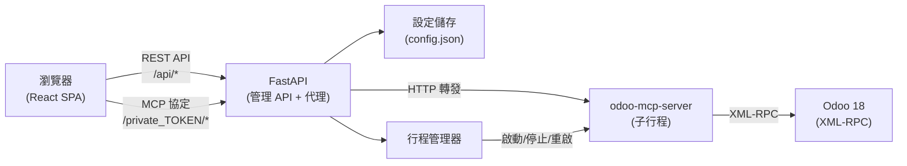

<p align="center">
  
</p>

<h1 align="center">Woow Odoo MCP Server</h1>

<p align="center">
  <strong>Odoo MCP Server 正式環境管理套件</strong><br/>
  Web 管理介面 + MCP 反向代理 + 行程管理器 — 全部整合於單一容器
</p>

<p align="center">
  <a href="#概述">概述</a> &bull;
  <a href="#功能特色">功能特色</a> &bull;
  <a href="#系統架構">系統架構</a> &bull;
  <a href="#快速開始">快速開始</a> &bull;
  <a href="#安裝方式">安裝方式</a> &bull;
  <a href="#設定說明">設定說明</a> &bull;
  <a href="#畫面截圖">畫面截圖</a> &bull;
  <a href="#api-參考">API</a> &bull;
  <a href="#安全性">安全性</a> &bull;
  <a href="#測試">測試</a> &bull;
  <a href="#更新日誌">更新日誌</a> &bull;
  <a href="README.md">English</a>
</p>

<p align="center">
  
  
  
  
  
  
  
  
  
</p>

---

## 概述

**Woow Odoo MCP Server** 是一套完整的 [Odoo MCP Server](https://pypi.org/project/odoo-mcp-server/) 部署管理套件。透過現代化的 Web 介面，你可以設定 Odoo 連線、管理 MCP 工具、輪換認證 Token、即時串流日誌，以及代理 MCP 協定請求 — 全部打包成單一容器映像。

本套件讓你不再需要另外建置 nginx 代理、手動編輯設定檔，或使用 kubectl 指令。所有操作都能透過簡潔的響應式 Web 介面完成。

### 為什麼選擇這個套件？

| 挑戰 | 解決方案 |
|------|----------|
| MCP 伺服器設定需要手動編輯 JSON 或 K8s Secrets | Web 圖形介面，即時驗證，一鍵儲存 |
| Token 輪換需要手動更新 Secret 並重啟 Pod | 一鍵 Token 輪換，自動重啟 MCP 伺服器 |
| MCP 代理需要另外設定 nginx + 認證 | 內建反向代理，URL 路徑 Token 認證 |
| 監控 MCP 伺服器日誌需要 `kubectl logs` 或 SSH | 瀏覽器內即時 SSE 日誌串流，支援搜尋 |
| 啟用/停用 MCP 工具需要編輯設定檔 + 重啟 | 視覺化工具管理器，10 個分類，開關切換 |
| 測試 Odoo 連線需要撰寫 XML-RPC 腳本 | 一鍵連線測試，支援 Odoo 18 認證格式 |
| 分別部署各元件太複雜 | 單一容器，全部包含 |

---

## 功能特色

### 儀表板

即時監控堆疊中所有元件的健康狀態：

- **Odoo 狀態** — 檢查 `/web/health` 端點，顯示版本、資料庫名稱、已安裝模組數量
- **MCP 伺服器狀態** — 子行程健康狀態、PID、重啟次數
- **MCP 代理狀態** — 內建代理，管理介面運行時始終健康
- **整體狀態** — 彙總顯示 `正常` / `降級` / `錯誤` 指標

### 連線設定

管理 Odoo XML-RPC 連線憑證：

- 設定 Odoo URL、資料庫名稱、使用者名稱和密碼
- **一鍵連線測試**，完整的錯誤回報
- 同時支援 **Odoo 18**（新版 `authenticate()` 簽章）和 **Odoo 17**（舊版格式）
- 連線設定變更時自動重啟 MCP 伺服器

### 工具管理器

視覺化管理全部 **39 個 MCP 工具**，分為 **10 個類別**：

| 類別 | 數量 | 說明 |
|------|------|------|
| 讀取與探索 | 11 | 結構瀏覽、記錄搜尋、員工/假期查詢 |
| 寫入與操作 | 5 | 預覽、驗證、執行寫入、Chatter 發文 |
| 診斷 | 3 | 錯誤分析、存取權限偵錯、關聯檢查 |
| 遷移 | 3 | JSON2 資料匯入、升級風險報告、版本歷史 |
| 稽核與規劃 | 3 | 附加模組原始碼掃描、適配差距分析、業務套件報告 |
| 知識庫 | 3 | 知識庫索引、語意搜尋、覆蓋率統計 |
| 會計 | 2 | 應收/應付帳款帳齡分析、會計健康摘要 |
| 背景任務 | 4 | 非同步任務提交、狀態查詢、取消、列表 |
| 跨實例 | 3 | 多實例搜尋、聚合、健康比較 |
| 工具 | 2 | 健康檢查、實例列表 |

每個工具都可以個別啟用或停用。具有寫入風險的工具會以警告標記清楚標示。

### Token 管理器

管理 MCP 代理認證 Token：

- 檢視目前 Token（遮蔽顯示）及前綴識別碼
- **一鍵 Token 輪換**，使用密碼學安全的隨機產生
- 可設定 Token 長度（16-128 位元組，輸出為 2 倍 hex 字元）
- 輪換歷史紀錄附時間戳記（保留最近 10 次）
- 輪換後可選擇自動重啟 MCP 伺服器

### 日誌檢視器

即時 MCP 伺服器日誌串流：

- **Server-Sent Events (SSE)** 零延遲日誌傳送
- 記憶體環形緩衝區（5000 行），可設定尾端行數
- **全文搜尋**，支援純文字和正規表達式
- 附時間戳記的日誌項目，標註來源
- 自動捲動，使用者互動時暫停

### 系統設定

完整的設定管理：

- 透過 GUI 檢視與編輯完整 `config.json`
- 各區段獨立編輯：connection、mcp_server、proxy、tools
- 管理員密碼管理
- MCP 認證 Token 輪換
- **MCP 伺服器重啟**與狀態監控

### MCP 反向代理

內建反向代理，取代傳統 nginx 認證代理：

- **URL 路徑 Token 認證**：`/private_{token}/sse`、`/private_{token}/messages`
- 相容 Claude Desktop、Cursor 及所有 MCP 用戶端
- 完整 SSE 串流支援，符合 MCP 協定
- 長逾時（預設 86400 秒），適用長時間執行的工具呼叫
- Bearer Token 轉發，支援上游認證

---

## 系統架構



應用程式採用分層架構設計：

```
┌─────────────────────────────────────────────────────┐
│                 瀏覽器 (React SPA)                    │
│  登入 → 儀表板 → 連線設定 → 工具管理 → Token 管理      │
│                  → 日誌檢視 → 系統設定                 │
├─────────────────────────────────────────────────────┤
│                FastAPI 應用程式                        │
│  ┌──────────┐ ┌──────────┐ ┌──────────┐             │
│  │ 認證     │ │ 管理     │ │ MCP      │             │
│  │ 中介層   │ │ 路由器   │ │ 代理     │             │
│  │          │ │ (7 組)   │ │ 路由器   │             │
│  └────┬─────┘ └────┬─────┘ └────┬─────┘             │
│       │            │            │                    │
│  ┌────▼────────────▼────────────▼─────┐              │
│  │           核心服務                  │              │
│  │   設定儲存 │ 行程管理器             │              │
│  └────────────────────────────────────┘              │
├─────────────────────────────────────────────────────┤
│  odoo-mcp-server（子行程，port :8000）                │
│  39 個 MCP 工具 │ SSE 傳輸 │ XML-RPC 用戶端          │
├─────────────────────────────────────────────────────┤
│  Odoo 18（外部服務，port :8069）                      │
│  PostgreSQL │ 商業邏輯 │ ORM                         │
└─────────────────────────────────────────────────────┘
```

**核心套件：**

| 套件 | 說明 |
|------|------|
| `mcp_admin_core` | 共用基礎：FastAPI 應用工廠、JWT 認證中介層、檔案型設定儲存、子行程管理器、MCP 反向代理 |
| `odoo_mcp_admin` | Odoo 專用路由器：連線設定、健康儀表板、39 工具註冊表、Token 管理、SSE 日誌檢視 |
| `frontend` | React 19 SPA，搭配 Tailwind CSS，使用 Vite 建置 |

完整的架構文件含 Mermaid 圖表，請參閱 [docs/architecture.md](docs/architecture.md)。

---

## 快速開始

### 一行指令（Podman 或 Docker）

```bash
# Podman
podman run -d --name mcp-admin \
  -p 8080:8080 \
  -v mcp-data:/data \
  ghcr.io/woowtech/woow-odoo-mcp-server:latest

# Docker
docker run -d --name mcp-admin \
  -p 8080:8080 \
  -v mcp-data:/data \
  ghcr.io/woowtech/woow-odoo-mcp-server:latest
```

開啟 `http://localhost:8080`，使用預設密碼 `admin` 登入。

### Docker Compose（完整堆疊）

一個指令啟動 Odoo 18 + PostgreSQL + MCP 管理介面：

```bash
git clone https://github.com/WOOWTECH/woow_odoo_mcp_server.git
cd woow_odoo_mcp_server
docker compose up -d
```

這會啟動三個服務：

| 服務 | 埠號 | 說明 |
|------|------|------|
| `postgres` | 5432（內部） | PostgreSQL 16，附帶健康檢查 |
| `odoo` | 8069 | Odoo 18 社群版 |
| `mcp-admin` | 8080 | MCP 管理套件 |

Odoo 初始化完成後，開啟 `http://localhost:8080` 設定連線：

- **Odoo URL**：`http://odoo:8069`
- **資料庫**：`odoo`
- **使用者名稱**：`admin`
- **密碼**：`admin`

---

## 安裝方式

### 方式一：Podman（推薦）

Podman 無需 root 權限且無需背景服務，非常適合 MCP 伺服器部署。

```bash
# 從原始碼建置
podman build -t woow-odoo-mcp-server .

# 執行，搭配持久化設定
podman run -d --name mcp-admin \
  -p 8080:8080 \
  -v mcp-data:/data \
  woow-odoo-mcp-server

# 檢視日誌
podman logs -f mcp-admin
```

### 方式二：Docker

```bash
# 建置
docker build -t woow-odoo-mcp-server .

# 執行
docker run -d --name mcp-admin \
  -p 8080:8080 \
  -v mcp-data:/data \
  -e JWT_SECRET=your-secret-here \
  woow-odoo-mcp-server
```

### 方式三：Docker Compose

```bash
# 完整堆疊（PostgreSQL + Odoo + MCP Admin）
docker compose up -d

# 僅 MCP Admin（連接現有 Odoo）
docker compose up -d mcp-admin
```

### 方式四：Kubernetes (K3s)

部署至 Kubernetes 叢集，含 RBAC、健康檢查和資源限制：

```bash
# 套用部署清單（依需求調整 namespace）
kubectl apply -f k8s-deploy.yaml

# 確認部署狀態
kubectl get pods -n kasim-odoo -l app=odoo-mcp-admin

# 本機 port-forward 存取
kubectl port-forward -n kasim-odoo svc/odoo-mcp-admin-svc 8080:9001
```

K8s 部署包含：

- **ServiceAccount**，namespace 範圍的 RBAC（Secrets、ConfigMaps、Pods、Deployments）
- **就緒探針** `/healthz`（初始延遲 5 秒，間隔 10 秒）
- **存活探針** `/healthz`（初始延遲 15 秒，間隔 30 秒）
- **資源限制**：100m-500m CPU、128Mi-512Mi 記憶體
- **control-plane nodeSelector** 確保可預測的排程

### 方式五：開發模式

```bash
# 後端
python -m venv .venv
source .venv/bin/activate
pip install -e ".[dev]"
uvicorn odoo_mcp_admin.main:app --host 0.0.0.0 --port 8080 --reload

# 前端（另開終端機）
cd frontend
npm install
npm run dev
```

---

## 設定說明

### Web GUI 操作流程

啟動容器後：

1. **登入** — 瀏覽 `http://localhost:8080`，輸入管理員密碼（預設：`admin`）
2. **連線設定** — 進入連線頁面，填入 Odoo URL、資料庫、使用者名稱和密碼，點擊**測試連線**
3. **工具管理** — 瀏覽全部 39 個 MCP 工具，依需求切換啟用/停用
4. **Token 管理** — 點擊**輪換 Token** 產生 MCP 認證 Token — 請妥善保存，供 MCP 用戶端設定使用
5. **系統設定** — 設定 MCP 伺服器指令、埠號和環境變數
6. **儀表板** — 確認所有元件顯示綠色健康狀態

### config.json 格式

設定檔在首次執行時自動建立於 `/data/config.json`：

```json
{
  "admin_password": "admin",
  "mcp_auth_token": "a1b2c3d4e5f6...",
  "connection": {
    "odoo_url": "http://odoo:8069",
    "odoo_db": "mydb",
    "odoo_username": "admin",
    "odoo_password": "secret"
  },
  "mcp_server": {
    "command": "odoo-mcp-server",
    "args": ["--transport", "sse"],
    "port": 8000,
    "env": {
      "ODOO_URL": "http://odoo:8069",
      "ODOO_DB": "mydb"
    }
  },
  "proxy": {
    "timeout": 86400,
    "bearer_token": null
  },
  "tools": {
    "disabled": ["execute_method"],
    "disabled_operations": {}
  },
  "token_history": []
}
```

### 環境變數

| 變數名稱 | 預設值 | 說明 |
|----------|--------|------|
| `MCP_ADMIN_CONFIG` | `/data/config.json` | 設定檔路徑 |
| `JWT_SECRET` | （自動產生） | JWT Token 簽章金鑰。設定此值可讓 Token 在容器重啟後持續有效 |
| `JWT_EXPIRY_HOURS` | `24` | JWT Token 到期時間（小時） |

### MCP 用戶端設定

透過管理介面產生 Token 後，設定你的 MCP 用戶端：

**Claude Desktop / Cursor：**

```json
{
  "mcpServers": {
    "odoo": {
      "url": "http://your-server:8080/private_YOUR_TOKEN_HERE/sse"
    }
  }
}
```

**Claude Code CLI：**

```bash
claude mcp add odoo --transport sse \
  http://your-server:8080/private_YOUR_TOKEN_HERE/sse
```

---

## 畫面截圖

### 登入頁面

<p align="center">
  
</p>

JWT 認證機制。預設密碼為 `admin`。支援 Cookie 和 Authorization Header 認證。

### 儀表板

<p align="center">
  
</p>

即時監控 Odoo、MCP 伺服器和 MCP 代理的健康狀態。顯示 Odoo 版本、資料庫名稱、已安裝模組數量及系統整體狀態。

### 連線設定

<p align="center">
  
</p>

設定與測試 Odoo XML-RPC 連線。支援 Odoo 18（新版憑證字典格式）和 Odoo 17（位置參數格式）。一鍵測試，詳細錯誤回報。

### 工具管理器

<p align="center">
  
</p>

視覺化管理全部 39 個 MCP 工具，涵蓋 10 個分類。個別切換工具啟用/停用。危險（寫入）工具以明顯標記區分。變更即時儲存。

### Token 管理器

<p align="center">
  
</p>

管理 MCP 代理認證 Token。一鍵輪換，密碼學安全的 Token 產生。附時間戳記的輪換歷史。Token 僅在輪換後顯示一次。

### 日誌檢視器

<p align="center">
  
</p>

來自 MCP 伺服器子行程的即時 SSE 日誌串流。記憶體環形緩衝區，支援全文搜尋和正規表達式搜尋。自動捲動，可手動暫停。

### 系統設定

<p align="center">
  
</p>

完整的設定管理介面。編輯 MCP 伺服器指令、參數、埠號、環境變數。管理員密碼管理。MCP 伺服器重啟與狀態監控。

---

## API 參考

所有 API 端點均需 JWT 認證（登入和健康檢查除外）。

### 認證

| 方法 | 端點 | 說明 |
|------|------|------|
| `POST` | `/api/auth/login` | 使用管理員密碼認證，回傳 JWT |

### 健康狀態與儀表板

| 方法 | 端點 | 說明 |
|------|------|------|
| `GET` | `/healthz` | 基本健康檢查（無需認證） |
| `GET` | `/api/health` | 完整儀表板健康資料（Odoo、MCP、代理狀態） |

### 連線設定

| 方法 | 端點 | 說明 |
|------|------|------|
| `GET` | `/api/config` | 取得目前 Odoo 連線設定（密碼遮蔽） |
| `PUT` | `/api/config/connection` | 更新 Odoo 連線憑證 |
| `POST` | `/api/config/test` | 測試 Odoo XML-RPC 連線 |

### 工具管理

| 方法 | 端點 | 說明 |
|------|------|------|
| `GET` | `/api/tools` | 列出全部 39 個工具，含分類與啟用狀態 |
| `PUT` | `/api/tools` | 更新工具啟用/停用狀態 |

### Token 管理

| 方法 | 端點 | 說明 |
|------|------|------|
| `GET` | `/api/tokens` | 取得目前 Token（遮蔽顯示）與輪換歷史 |
| `POST` | `/api/tokens/rotate` | 產生新 Token，更新設定，重啟伺服器 |

### 系統設定

| 方法 | 端點 | 說明 |
|------|------|------|
| `GET` | `/api/settings` | 取得完整設定（密碼遮蔽） |
| `PUT` | `/api/settings/{section}` | 更新設定區段 |
| `GET` | `/api/settings/{section}` | 取得單一設定區段 |
| `POST` | `/api/settings/mcp_auth_token/rotate` | 輪換 MCP 認證 Token |
| `GET` | `/api/settings/mcp/status` | MCP 伺服器行程狀態 |
| `POST` | `/api/settings/mcp/restart` | 重啟 MCP 伺服器行程 |

### 日誌串流

| 方法 | 端點 | 說明 |
|------|------|------|
| `GET` | `/api/logs/stream` | SSE 端點，即時日誌串流 |
| `GET` | `/api/logs/search` | 搜尋記憶體日誌緩衝區（純文字或正規表達式） |

### MCP 代理

| 方法 | 端點 | 說明 |
|------|------|------|
| `*` | `/private_{token}/{path}` | 反向代理至 MCP 伺服器（支援所有 HTTP 方法） |

---

## 安全性

### 認證機制

- **JWT 認證**，可設定到期時間（預設：24 小時）
- 管理員密碼儲存於 `config.json`（請在首次登入後立即更改預設密碼）
- 若未設定 `JWT_SECRET` 環境變數，啟動時自動產生 JWT 金鑰
- Cookie 認證搭配 `httponly`、`samesite=strict` 旗標
- SSE 端點支援 query parameter Token，相容 EventSource

### MCP Token 認證

- MCP 代理依據設定儲存驗證 URL 路徑 Token
- Token 使用 `secrets.token_hex()` 密碼學安全產生
- Token 輪換後舊 Token 立即失效
- Token 歷史保留最近 10 筆輪換紀錄，供稽核使用
- 所有 API 回應中的敏感值均以遮蔽方式顯示

### 網路安全

- CORS 中介層（預設：允許所有來源 — 正式環境請加以限制）
- 認證中介層對所有 `/api/*` 路由強制 JWT 認證（登入除外）
- MCP 代理路徑（`/private_*`）繞過 JWT 認證（由代理自行驗證 Token）
- Kubernetes 部署包含 namespace 範圍的 RBAC 權限

### 安全最佳實務

1. **首次登入後立即更改預設管理員密碼**
2. **設定 `JWT_SECRET` 環境變數**，確保 Token 在容器重啟後持續有效
3. **正式環境限制 CORS 來源**
4. **使用 Kubernetes NetworkPolicy** 限制 Pod 間通訊
5. **停用危險工具**（寫入與操作類別），除非確實需要
6. **定期使用 Token 管理器輪換 MCP Token**

---

## 測試

### 測試覆蓋率摘要

管理套件通過完整的 22 項測試矩陣驗證：

| # | 測試項目 | 狀態 |
|---|----------|------|
| 1 | 容器建置成功 | 通過 |
| 2 | 容器啟動並監聽 8080 埠 | 通過 |
| 3 | `/healthz` 回傳 200 | 通過 |
| 4 | 使用正確密碼登入回傳 JWT | 通過 |
| 5 | 使用錯誤密碼登入回傳 401 | 通過 |
| 6 | 無 Token 存取 API 端點回傳 401 | 通過 |
| 7 | 儀表板端點回傳健康資料 | 通過 |
| 8 | 連線設定 GET 回傳遮蔽密碼 | 通過 |
| 9 | 連線設定 PUT 更新並持久化 | 通過 |
| 10 | 對線上 Odoo 的連線測試成功 | 通過 |
| 11 | 工具列表回傳 39 個工具，10 個分類 | 通過 |
| 12 | 工具切換持久化停用狀態 | 通過 |
| 13 | Token 輪換產生新 Token | 通過 |
| 14 | Token 輪換重啟 MCP 伺服器 | 通過 |
| 15 | 日誌串流 SSE 端點連線成功 | 通過 |
| 16 | 日誌搜尋回傳篩選結果 | 通過 |
| 17 | 系統設定 GET 回傳完整設定 | 通過 |
| 18 | 系統設定 PUT 更新個別區段 | 通過 |
| 19 | MCP 代理轉發至子行程 | 通過 |
| 20 | MCP 代理拒絕無效 Token | 通過 |
| 21 | 設定在容器重啟後持久化 | 通過 |
| 22 | 前端 SPA 載入並渲染 | 通過 |

**結果：22/22 測試通過**

### 執行測試

```bash
# 安裝開發依賴
pip install -e ".[dev]"

# 執行測試
pytest -v

# 含覆蓋率報告
pytest --cov=mcp_admin_core --cov=odoo_mcp_admin -v
```

---

## 專案結構

```
woow_odoo_mcp_server/
├── mcp_admin_core/              # 共用核心程式庫
│   ├── __init__.py
│   ├── app.py                   # FastAPI 應用工廠
│   ├── process.py               # MCP 子行程管理器
│   ├── proxy.py                 # MCP 反向代理路由器
│   ├── mcp_sse_wrapper.py       # SSE 傳輸包裝器
│   ├── auth/
│   │   ├── __init__.py
│   │   └── middleware.py        # JWT 認證中介層 + 登入路由器
│   ├── config/
│   │   ├── __init__.py
│   │   └── store.py             # 檔案型設定儲存
│   ├── routers/
│   │   ├── __init__.py
│   │   └── settings.py          # 設定 CRUD 路由器
│   └── k8s/
│       ├── __init__.py
│       └── client.py            # Kubernetes API 用戶端
├── odoo_mcp_admin/              # Odoo 專用管理後端
│   ├── __init__.py
│   ├── main.py                  # FastAPI 應用進入點
│   ├── tool_registry.py         # 39 個 Odoo MCP 工具定義
│   └── routers/
│       ├── __init__.py
│       ├── config.py            # Odoo 連線設定
│       ├── health.py            # 儀表板健康端點
│       ├── tools.py             # 工具管理
│       ├── tokens.py            # Token 輪換
│       └── logs.py              # SSE 日誌串流
├── frontend/                    # React 19 SPA
│   ├── package.json
│   ├── vite.config.js
│   ├── index.html
│   └── src/
│       ├── main.jsx
│       ├── App.jsx
│       ├── api.js
│       ├── index.css
│       ├── components/
│       │   ├── Sidebar.jsx
│       │   └── StatusCard.jsx
│       └── pages/
│           ├── LoginPage.jsx
│           ├── Dashboard.jsx
│           ├── ConnectionConfig.jsx
│           ├── ToolManager.jsx
│           ├── TokenManager.jsx
│           ├── LogViewer.jsx
│           ├── SettingsPage.jsx
│           └── PermissionEditor.jsx
├── docs/
│   ├── architecture.md          # 詳細架構文件
│   └── screenshots/             # 介面截圖
├── Dockerfile                   # 多階段建置（Node + Python）
├── docker-compose.yml           # 完整堆疊：PostgreSQL + Odoo + Admin
├── k8s-deploy.yaml              # Kubernetes 部署清單
├── pyproject.toml               # Python 套件設定
├── LICENSE                      # MIT 授權
├── CONTRIBUTING.md              # 貢獻指南
├── README.md                    # 英文文件
└── README_zh-TW.md              # 本檔案（正體中文文件）
```

---

## 更新日誌

### v1.0.0 (2026-06-26)

**首次發布**

- 完整管理 Web GUI，含 7 個頁面（登入、儀表板、連線設定、工具管理、Token 管理、日誌檢視、系統設定）
- 內建 MCP 反向代理，URL 路徑 Token 認證
- MCP 伺服器子行程管理器，支援自動重啟
- 檔案型設定儲存（`config.json`），完全可攜
- JWT 認證中介層，支援 Cookie 和 Header 認證
- 39 個 Odoo MCP 工具註冊表，10 個分類
- 即時 SSE 日誌串流，記憶體環形緩衝區（5000 行）
- Token 輪換，密碼學安全產生，附輪換歷史
- Odoo 連線測試，相容 Odoo 18 和 Odoo 17
- 多階段 Docker 建置（Node 20 + Python 3.12）
- Docker Compose 完整堆疊部署（PostgreSQL + Odoo + Admin）
- Kubernetes 部署，含 RBAC、健康探針和資源限制
- 完整 22 項測試驗證

---

## 疑難排解

### MCP 伺服器無法啟動

1. 檢查**系統設定**頁面，確認 `mcp_server.command` 已設定（例如 `odoo-mcp-server`）
2. 確認容器內已安裝 `odoo-mcp-server`：`pip list | grep odoo-mcp`
3. 檢查**日誌**頁面的啟動錯誤

### 連線測試失敗

1. 確認 Odoo URL 可從容器內存取（Docker/K8s 中使用服務名稱）
2. 資料庫名稱必須完全一致（區分大小寫）
3. Odoo 18 的認證格式與 Odoo 17 不同，請確認憑證正確

### MCP 用戶端 Token 無效

1. 確認複製了完整的 Token（64 個 hex 字元）
2. MCP URL 格式必須為：`http://host:8080/private_TOKEN/sse`
3. 若長時間執行的工具呼叫逾時，請檢查代理逾時設定

### 容器立即退出

1. 確認 8080 埠未被其他程式使用
2. 確認 `/data` 磁碟區可寫入
3. 檢查容器日誌：`docker logs mcp-admin`

---

## 相關專案

- [odoo-mcp-server](https://pypi.org/project/odoo-mcp-server/) — 提供 39 個工具，透過 XML-RPC 與 Odoo 互動的 MCP 伺服器
- [Woow Odoo AI Assistant Package](https://github.com/WOOWTECH/Woow_odoo_ai_assistant_package) — Odoo 18 企業級 AI 助理套件，整合 ChatGPT、Claude、Gemini
- [Model Context Protocol (MCP)](https://modelcontextprotocol.io/) — 連接 AI 模型與資料來源的開放協定

---

## 授權

本專案採用 [MIT 授權條款](LICENSE)。

Copyright (c) 2026 WOOWTECH

---

## 支援

- **GitHub Issues**：[github.com/WOOWTECH/woow_odoo_mcp_server/issues](https://github.com/WOOWTECH/woow_odoo_mcp_server/issues)
- **Email**：dev@woowtech.io
- **官方網站**：[woowtech.io](https://woowtech.io)

---

<p align="center">
  由 <a href="https://woowtech.io">WOOWTECH</a> 用心打造
</p>
