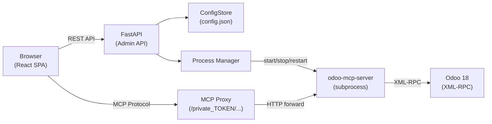
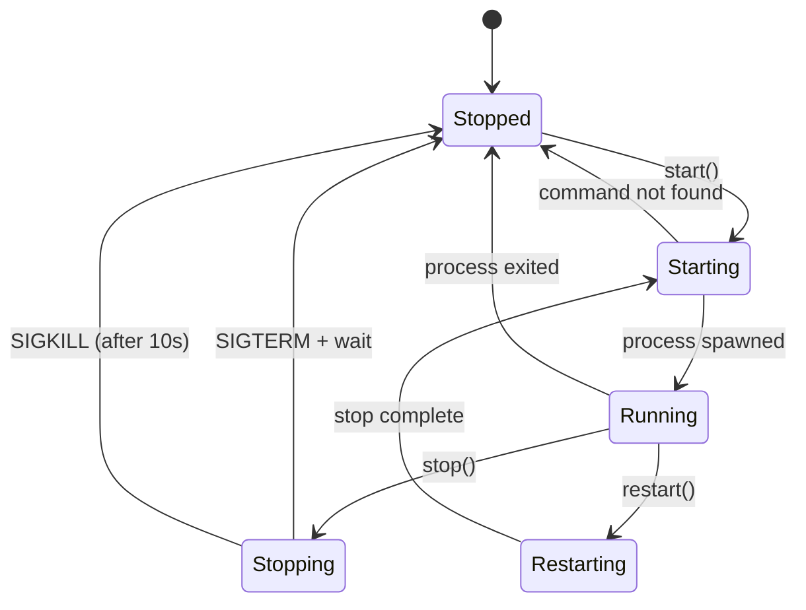
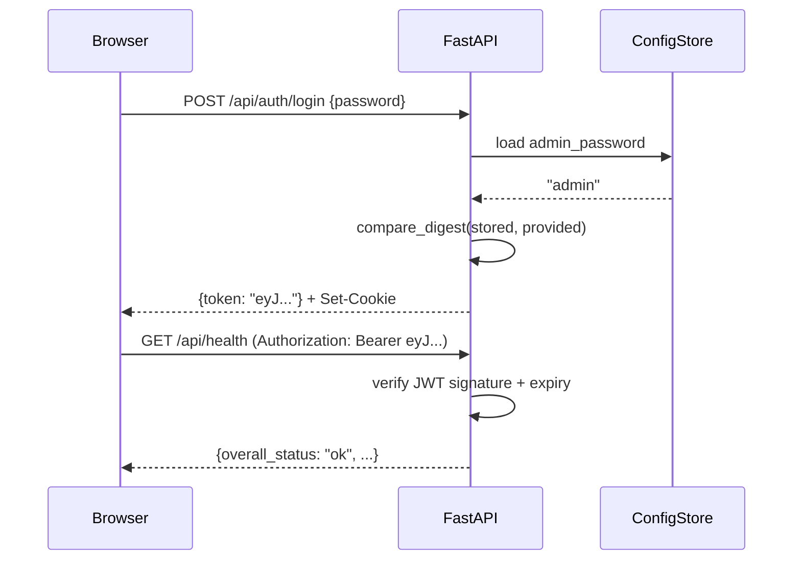

# Architecture

This document describes the internal architecture of the Odoo MCP Admin Bundle.

## System Overview

The bundle runs as a single container that combines three responsibilities:

1. **Admin Web GUI** -- A React SPA served by FastAPI for managing MCP server configuration
2. **MCP Reverse Proxy** -- Token-authenticated proxy that forwards MCP protocol requests to the subprocess
3. **MCP Process Manager** -- Manages the `odoo-mcp-server` subprocess lifecycle



## Component Details

### Frontend (React 19 + Tailwind CSS)

The frontend is a single-page application built with Vite, React 19, and Tailwind CSS.

| Page | Route | Description |
|------|-------|-------------|
| Login | `/login` | JWT authentication with admin password |
| Dashboard | `/` | Health status of Odoo, MCP Server, and Proxy |
| Connection | `/connection` | Odoo URL, database, username, password configuration |
| Tools | `/tools` | Enable/disable 39 MCP tools across 10 categories |
| Tokens | `/tokens` | MCP authentication token management with rotation |
| Logs | `/logs` | Real-time SSE log streaming from MCP server |
| Settings | `/settings` | Full config.json editor with MCP server restart |

### Backend (FastAPI + Python 3.12)

The backend is split into two Python packages:

- **mcp_admin_core** -- Shared foundation: app factory, auth middleware, config store, process manager, proxy
- **odoo_mcp_admin** -- Odoo-specific routers: connection config, health dashboard, tool registry, token manager, log viewer

### Config Store

All configuration is stored in a single JSON file (`/data/config.json`), making the application fully portable across Docker, Podman, and Kubernetes environments.

```json
{
  "admin_password": "...",
  "mcp_auth_token": "...",
  "connection": {
    "odoo_url": "http://odoo:8069",
    "odoo_db": "mydb",
    "odoo_username": "admin",
    "odoo_password": "..."
  },
  "mcp_server": {
    "command": "odoo-mcp-server",
    "args": ["--transport", "sse"],
    "port": 8000,
    "env": {}
  },
  "proxy": {
    "timeout": 86400
  },
  "tools": {
    "disabled": [],
    "disabled_operations": {}
  },
  "token_history": []
}
```

### MCP Reverse Proxy

The built-in reverse proxy replaces the traditional nginx auth proxy pattern. It validates the URL-path token (`/private_{token}/...`) against the config store, then streams the request to the MCP server subprocess on localhost.

Key design decisions:
- **URL-path token** instead of Bearer header -- compatible with Claude Desktop and other MCP clients that cannot set custom headers
- **Streaming support** -- full SSE and chunked transfer encoding for MCP protocol compatibility
- **Long timeout** -- 86400s default for long-running MCP tool calls

### Process Manager

The process manager handles the MCP server subprocess lifecycle:



### Authentication Flow



## Deployment Architectures

### Standalone (Docker / Podman)

```
┌──────────────────────────────────┐
│  Container: woow-odoo-mcp-server │
│                                  │
│  FastAPI (:8080)                 │
│    ├── Admin GUI (React SPA)     │
│    ├── REST API (/api/*)         │
│    └── MCP Proxy (/private_*)    │
│                                  │
│  odoo-mcp-server (:8000)         │
│    └── MCP Protocol (SSE)        │
│                                  │
│  /data/config.json               │
└──────────────┬───────────────────┘
               │ XML-RPC
               ▼
         ┌──────────┐
         │  Odoo 18  │
         └──────────┘
```

### Kubernetes (K3s)

```
┌─────────────────────────────────────────────────┐
│  Namespace: tenant-odoo                          │
│                                                  │
│  ┌──────────────────┐  ┌──────────────────────┐  │
│  │ odoo-mcp-admin   │  │ mcp-odoo             │  │
│  │ Deployment       │  │ Deployment            │  │
│  │ (port 9001)      │  │ (odoo-mcp-server)     │  │
│  └────────┬─────────┘  └────────┬──────────────┘  │
│           │                      │                 │
│  ┌────────▼──────────────────────▼──────────────┐  │
│  │ ServiceAccount + RBAC (Secrets, ConfigMaps)  │  │
│  └──────────────────────────────────────────────┘  │
│                                                  │
│  ┌──────────────┐  ┌────────────────────────┐    │
│  │ Odoo + Nginx │  │ cloudflared (Tunnel)   │    │
│  │ (port 8069)  │  │ → *.woowtech.io        │    │
│  └──────────────┘  └────────────────────────┘    │
└─────────────────────────────────────────────────┘
```
